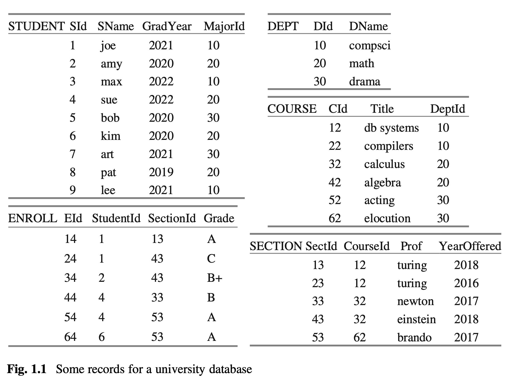
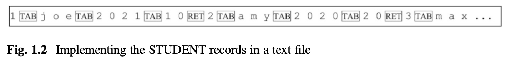
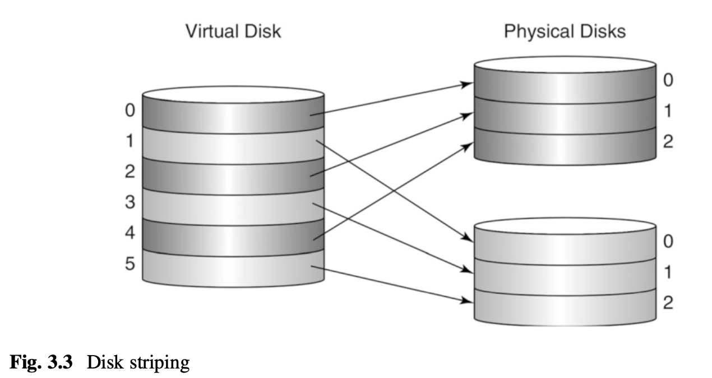
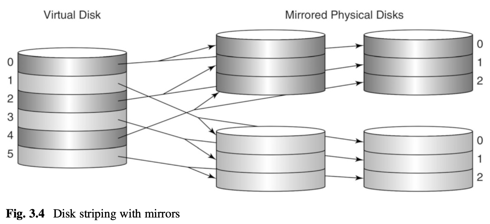
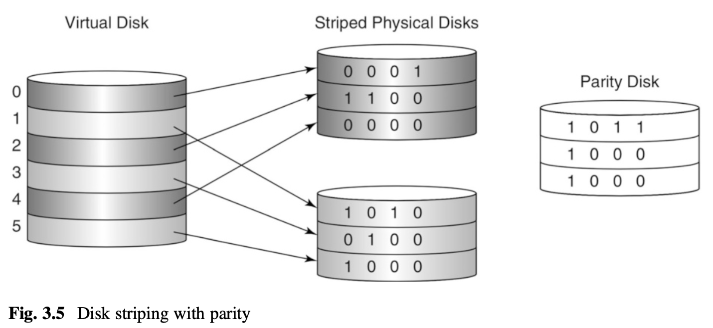
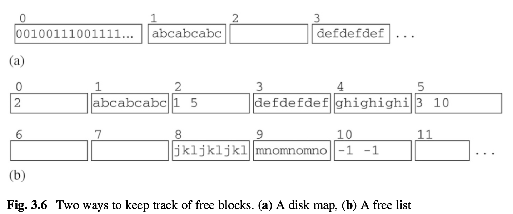
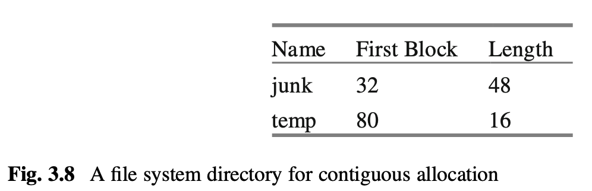
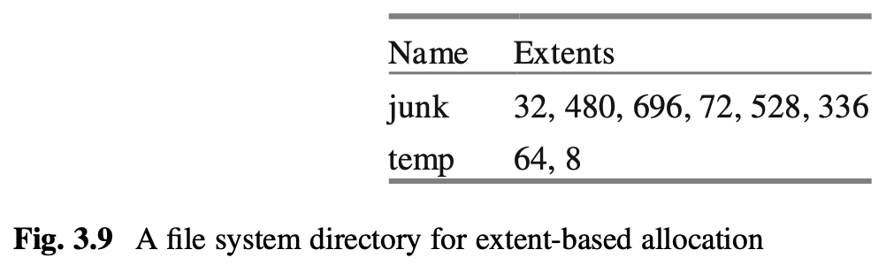
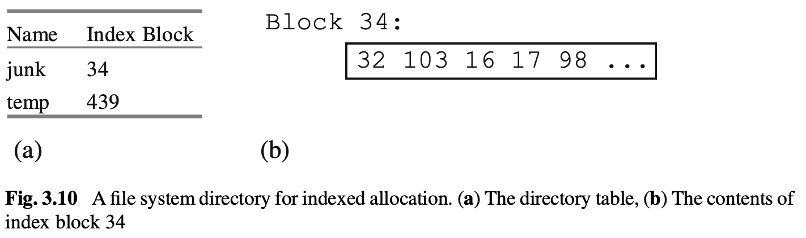
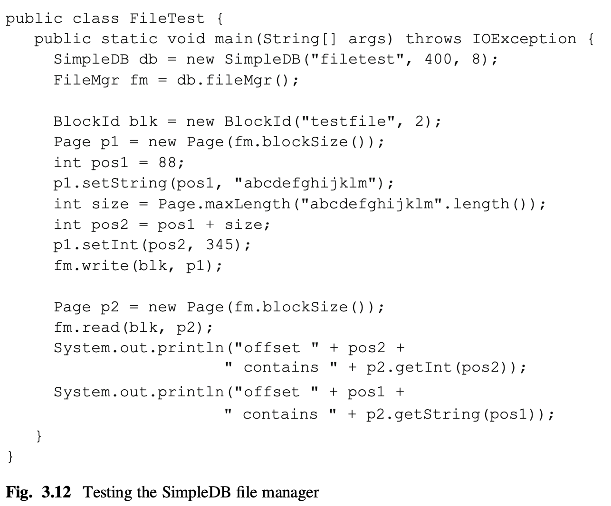

# 1 データベースシステム
データベースシステムはコンピュータ業界で重要な役割を果たしています。一部のデータベースシステム（例えばOracle）は非常に複雑で、通常は大規模なハイエンドマシン上で動作します。他方、一部（例えばSQLite）は小さく、効率的で、アプリケーション固有のデータの保存を目的としています。幅広い用途にもかかわらず、すべてのデータベースシステムには共通の特徴があります。この章では、データベースシステムが対処しなければならない問題と、期待される機能について調査します。また、本書で議論されるDerbyとSimpleDBデータベースシステムを紹介します。

## 1-1. データベースシステムの必要性
データベースとは、コンピュータ上に保存されたデータの集合体です。データベース内のデータは通常、従業員の記録、医療記録、販売記録などのレコードに組織化されます。図1.1は、大学の学生と彼らが受講したコースに関する情報を保持するデータベースを示しています。このデータベースは本書全体を通じての実例として使用されます。図1.1のデータベースには5種類のレコードが含まれています：

- 大学に在籍した各学生に対して、STUDENTレコードがあります。各レコードには、学生のID番号、名前、卒業年度、専攻部門のIDが含まれています。
- 大学の各部門に対して、DEPTレコードがあります。各レコードには、部門のID番号と名前が含まれています。
- 大学が提供する各コースに対して、COURSEレコードがあります。各レコードには、コースのID番号、タイトル、それを提供する部門のIDが含まれています。
- これまでに提供されたコースの各セクションに対して、SECTIONレコードがあります。各レコードには、セクションのID番号、セクションが提供された年度、コースのID、そのセクションを教える教授が含まれています。
- 学生が受講した各コースに対して、ENROLLレコードがあります。各レコードには、登録ID番号、学生と受講したコースのセクションのID番号、学生がコースで受けた成績が含まれています。

図1.1は、いくつかのレコードの概念的な図です。レコードがどのように保存され、どのようにアクセスされるかについては何も示していません。データベースシステムと呼ばれる多くの利用可能なソフトウェア製品があり、これらはレコードを管理するための広範な機能を提供します。
レコードを「管理する」とは何を意味するのでしょうか？データベースシステムはどのような機能を持つべきで、どの機能がオプションなのでしょうか？以下の5つの要件が基本的なものと思われます：

- データベースは永続的でなければなりません。そうでなければ、コンピュータをオフにするとすぐにレコードが消えてしまいます。
- データベースは共有可能でなければなりません。多くのデータベース、例えば私たちの大学のデータベースのようなものは、複数の同時ユーザーによって共有されることを意図しています。
- データベースは正確でなければなりません。ユーザーがデータベースの内容を信頼できない場合、それは無用で価値のないものとなります。
- データベースは非常に大きくなることがあります。図1.1のデータベースには29のレコードしか含まれていませんが、これはばかばかしく小さいです。データベースに数百万（あるいは数十億）のレコードが含まれていることは珍しくありません。
- データベースは使いやすくなければなりません。ユーザーが自分が必要とするデータに簡単にアクセスできない場合、生産性が低下し、他の製品を求める声が高まります。

以下の小節では、これらの要件の意味するところを検討します。各要件は、データベースシステムがますます多くの機能を含むように強制し、予想以上の複雑さをもたらします。

### 1-1-1. レコードストレージ
データベースを永続的にする一般的な方法は、そのレコードをファイルに保存することです。最もシンプルで直接的なアプローチは、データベースシステムがレコードをテキストファイルに保存し、レコードタイプごとに1つのファイルを用意することです。各レコードはテキストの一行で、その値はタブで区切られます。図1.2は、STUDENTレコードのテキストファイルの始まりを示しています。
このアプローチの利点は、ユーザーがテキストエディタでファイルを調査し、修正できることです。残念ながら、このアプローチは2つの理由から、効率が悪すぎて実用的ではありません。
最初の理由は、大きなテキストファイルの更新に時間がかかりすぎることです。例えば、誰かがSTUDENTファイルからJoeのレコードを削除するとします。データベースシステムは、Amyのレコードからファイルを書き直し、それぞれの後続のレコードを左に移動するしかありません。小さなファイルを書き直すのに必要な時間は無視できますが、1ギガバイトのファイルを書き直すのには数分かかる可能性があり、これは許容できないほど長いです。データベースシステムは、ファイルの更新が小さな、局所的な書き直しのみを必要とするように、レコードの保存方法についてもっと賢くなければなりません。
二つ目の理由は、大きなテキストファイルの読み取りに時間がかかりすぎることです。2019年度のクラスの学生をSTUDENTファイルから検索することを考えてみてください。唯一の方法は、ファイルを順次スキャンすることです。順次スキャンは非常に非効率的です。あなたはおそらく、ツリーやハッシュテーブルのような、高速な検索を可能にするメモリ内データ構造をいくつか知っているでしょう。データベースシステムは、そのファイルを実装するために類似のデータ構造を使用する必要があります。例えば、データベースシステムは、特定のタイプの検索（例えば、学生の名前、卒業年度、専攻など）を容易にする構造を使用してファイル内のレコードを組織化するか、またはそれぞれが異なるタイプの検索を容易にする複数の補助ファイルを作成するかもしれません。これらの補助ファイルはインデックスと呼ばれ、第12章の主題となります。

### 1-1-2. マルチユーザアクセス
多くのユーザーがデータベースを共有すると、そのデータファイルの一部に同時にアクセスする可能性が高くなります。並行性は良いことです。なぜなら、各ユーザーは他のユーザーが終了するのを待つことなく、すばやくサービスを受けることができるからです。しかし、並行性が過度になると、データベースが不正確になる可能性があります。例えば、旅行計画データベースを考えてみてください。2人のユーザーが残り40席のフライトに席を予約しようとするとします。両方のユーザーが同時に同じフライトのレコードを読むと、両方とも40席の空席を見ることになります。それから両方のユーザーがレコードを修正して、フライトには39席の空席があるようにします。おっと、2席が予約されましたが、データベースには1つの予約しか記録されていません。
この問題の解決策は、並行性を制限することです。データベースシステムは、最初のユーザーがフライトのレコードを読み、40席の空席を確認した後、最初のユーザーが終了するまで2番目のユーザーをブロックするべきです。2番目のユーザーが再開すると、39席の空席を確認し、それを38席に修正します。一般的に、データベースシステムは、ユーザーが他のユーザーの行動と競合する行動を行おうとしているときを検出し、そのとき（そしてそのときだけ）最初のユーザーが終了するまでそのユーザーの実行をブロックする能力が必要です。
また、ユーザーは自分が行ったデータベースの更新を元に戻す必要があるかもしれません。例えば、ユーザーが旅行計画データベースを検索してマドリードへの旅行を見つけ、利用可能なフライトと空室のあるホテルがある日付を見つけたとします。次に、ユーザーがフライトを予約するが、予約プロセスが進行中にその日のホテルがすべて満室になるとします。この場合、ユーザーはフライトの予約を取り消し、別の日付を試す必要があるかもしれません。
元に戻せる更新は、データベースの他のユーザーには見えないようにするべきです。そうでなければ、別のユーザーが更新を見て、データが「実際のもの」だと思い、それに基づいて決定を下す可能性があります。したがって、データベースシステムはユーザーに、自分の変更が永続的であると指定する能力を提供しなければなりません。ユーザーが変更をコミットすると言います。ユーザーがコミットすると、変更は可視化され、元に戻すことはできません。これらの問題については第5章で検討します。

## 1-2. Derbyデータベースシステム
3. データベースエンジン
4. SimpleDBデータベースシステム
5. SimpleDBのSQLバージョン
6. 章のまとめ
7. 推奨文献
8. 問題

# 2 JDBC
1. 基本的なJDBC
2. 高度なJDBC
3. JavaとSQLの計算
4. 章のまとめ
5. 推奨文献
6. 問題

# 3 ディスクとファイル管理
データベースエンジンは、ディスクやフラッシュドライブなどの永続的なストレージデバイスにデータを保持します。この章では、これらのデバイスの特性を調査し、その速度と信頼性を向上させるための技術（RAIDなど）を考察します。また、オペレーティングシステムがこれらのデバイスと対話するために提供する2つのインターフェース、ブロックレベルのインターフェースとファイルレベルのインターフェースを調査し、データベースシステムに最も適した2つのインターフェースの組み合わせを提案します。最後に、SimpleDBファイルマネージャーを詳細に考察し、そのAPIと実装を学習します。

## 3-1. 永続的なデータストレージ
データベースの内容は永続的に保持される必要があります。これにより、データベースシステムやコンピュータがダウンしてもデータが失われないようにします。このセクションでは、ディスクドライブとフラッシュドライブという2つの特に有用なハードウェア技術を調査します。フラッシュドライブはまだディスクドライブほど普及していませんが、その技術が成熟するにつれて重要性が増すでしょう。まずはディスクドライブから始めましょう。

### 3-1-1. ディスクドライブ
ディスクドライブには1つ以上の回転するプラッタが含まれています。プラッタには同心円状のトラックがあり、各トラックはバイトのシーケンスで構成されています。バイトは、可動式のアームによってプラッタから読み取られ（または書き込まれます）。このアームは所望のトラックに位置し、ヘッドはそれが下を回転するときにバイトを読み取る（または書き込む）ことができます。図3.1は、一枚のプラッタを持つディスクドライブの上面図を示しています。もちろん、この図はスケールに合わせて描かれていません。なぜなら、典型的なプラッタには数千のトラックがあるからです。

現代のディスクドライブには通常、複数のプラッタがあります。スペース効率のために、プラッタのペアは通常、背中合わせに結合され、二面のプラッタのように見えます。しかし概念的には、各面はまだ別のプラッタです。各プラッタには独自の読み書きヘッドがあります。これらのヘッドは独立して動くわけではありません。代わりに、それらはすべて単一のアクチュエータに接続され、それが各プラッタの同じトラックに同時に移動します。さらに、一度にアクティブにできる読み書きヘッドは1つだけです。なぜなら、コンピュータへのデータパスは1つだけだからです。図3.2は、マルチプラッタディスクドライブの側面図を示しています。
ディスクドライブの一般的な性能は、その容量、回転速度、転送速度、シーク時間の4つの値で測定することができます。

ドライブの容量は、保存できるバイト数です。この値は、プラッタの数、プラッタあたりのトラック数、トラックあたりのバイト数に依存します。プラッタは標準的なサイズで提供される傾向があるため、メーカーは主にプラッタの密度を増加させることで容量を増加させます。つまり、プラッタあたりのトラック数とトラックあたりのバイト数を増やします。現在では、40GB以上のプラッタ容量が一般的です。
回転速度は、プラッタが回転する速度で、通常は分あたりの回転数で表されます。典型的な速度は、5400rpmから15000rpmの範囲です。
転送速度は、バイトがディスクヘッドを通過する速度で、メモリへの転送を行います。例えば、1つのトラックのバイト全体は、プラッタが1回転する時間で転送できます。したがって、転送速度は回転速度とトラックあたりのバイト数の両方によって決まります。100MB/sの速度が一般的です。

シーク時間は、アクチュエータがディスクヘッドを現在の位置から要求されたトラックに移動するのにかかる時間です。この値は、移動する必要があるトラックの数に依存します。目的地のトラックが開始トラックと同じ場合、最低でも0（目的地と開始トラックがプラッタの異なる端にある場合、最高でも15～20ms）となります。平均シーク時間は、アクチュエータのディスクドライブ
ディスクドライブには一つ以上の回転するプラッタが含まれています。プラッタには同心円状のトラックがあり、各トラックはバイトの連続体で構成されています。バイトは、可動式のアームを介してプラッタから読み取られ（または書き込まれます）。アームは所望のトラックに位置し、ヘッドはそれが下を回転するときにバイトを読み取る（または書き込む）ことができます。図3.1は、一枚のプラッタを持つディスクドライブの上面図を示しています。もちろん、この図はスケールに合わせて描かれていません、なぜなら、典型的なプラッタには数千のトラックがあるからです。

現代のディスクドライブには通常、複数のプラッタがあります。スペース効率のために、プラッタのペアは通常、背中合わせに結合され、二面のプラッタのように見えますが、概念的には、各面はまだ別のプラッタです。各プラッタには独自の読み書きヘッドがあります。これらのヘッドは独立して動くわけではありません。代わりに、それらはすべて単一のアクチュエータに接続され、それが各プラッタの同じトラックに同時に移動します。さらに、一度にアクティブにできる読み書きヘッドは1つだけです、なぜなら、コンピュータへのデータパスは1つだけだからです。図3.2は、マルチプラッタディスクドライブの側面図を示しています。
ディスクドライブの一般的な性能は、その容量、回転速度、転送速度、シーク時間の4つの値で測定することができます。

ドライブの容量は、保存できるバイト数です。この値は、プラッタの数、プラッタあたりのトラック数、トラックあたりのバイト数に依存します。プラッタは標準的なサイズで提供される傾向があるため、メーカーは主にプラッタの密度を増加させることで容量を増加させます。つまり、プラッタあたりのトラック数とトラックあたりのバイト数を増やします。現在では、40GB以上のプラッタ容量が一般的です。
回転速度は、プラッタが回転する速度で、通常は分あたりの回転数で表されます。典型的な速度は、5400rpmから15000rpmの範囲です。

転送速度は、バイトがディスクヘッドを通過する速度で、メモリへの転送を行います。例えば、1つのトラックのバイト全体は、プラッタが1回転する時間で転送できます。したがって、転送速度は回転速度とトラックあたりのバイト数の両方によって決まります。100MB/sの速度が一般的です。

シーク時間は、アクチュエータがディスクヘッドを現在の位置から要求されたトラックに移動するのにかかる時間です。この値は、移動する必要があるトラックの数に依存します。目的地のトラックが開始トラックと同じ場合、最低でも0（目的地と開始トラックがプラッタの異なる端にある場合、最高でも15～20ms）となります。平均シーク時間は、アクチュエータの速度の合理的な推定値を提供します。現代のディスクの平均シーク時間は約5msです。
以下の例を考えてみましょう。4枚のプラッタを持つディスクドライブが10,000rpmで回転し、平均シーク時間が5msであるとします。各プラッタには10,000のトラックがあり、各トラックには500,000バイトが含まれています。以下にいくつかの計算値を示します：

ドライブの容量：
500,000バイト/トラック x 10,000トラック/プラッタ x 4プラッタ/ドライブ = 20,000,000,000バイト、つまり約20GB

転送速度：
500,000バイト/回転 x 10,000回転/60秒 = 83,333,333バイト/秒、つまり約83MB/s

### 3-1-2. ディスクドライブへのアクセス
ディスクアクセスは、ディスクドライブからメモリにいくつかのバイトを読み込むか、メモリからディスクにいくつかのバイトを書き込むリクエストです。これらのバイトは、あるプラッタのトラックの連続した部分に存在しなければなりません。ディスクドライブはディスクアクセスを3つのステージで実行します：
- ディスクヘッドを指定されたトラックに移動します。この時間はシーク時間と呼ばれます。
- プラッタが回転して最初の必要なバイトがディスクヘッドの下に来るまで待ちます。この時間は回転遅延と呼ばれます。
- プラッタが回転を続けると、ディスクヘッドの下に現れる各バイトを読み取り（または各バイトを書き込み）、最後の必要なバイトが現れるまで続けます。この時間は転送時間と呼ばれます。

ディスクアクセスを実行するために必要な時間は、シーク時間、回転遅延、転送時間の合計です。これらの時間はすべてディスクの機械的な動きに制約されています。機械的な動きは電気的な動きよりもはるかに遅いため、ディスクドライブはRAMよりも遅いです。シーク時間と回転遅延は特に厄介です。これらの二つの時間は、すべてのディスク操作が待たなければならないオーバーヘッドに過ぎません。

ディスクアクセスの正確なシーク時間と回転遅延を計算することは非現実的です。なぜなら、それにはディスクの前の状態を知る必要があるからです。代わりに、これらの時間を平均を使って推定することができます。平均シーク時間については既に知っています。平均回転遅延は簡単に計算できます。回転遅延は最低でも0（最初のバイトがたまたまヘッドの下にある場合）で、完全な回転の時間（最初のバイトがヘッドを通り過ぎたばかりの場合）までとなります。平均的には、プラッタがあなたが望む位置に来るまでに1/2回転待つ必要があります。したがって、平均回転遅延は回転時間の半分です。

転送時間も転送速度から簡単に計算できます。特に、転送速度がrバイト/秒で、bバイトを転送する場合、転送時間はb/r秒です。

例として、平均シーク時間が5msで転送速度が83MB/sの10,000rpmで回転するディスクドライブを考えてみましょう。以下にいくつかの計算されたコストを示します：
平均回転遅延：
60秒/分 x 1分/10,000回転 x 1/2回転 = 0.003秒または3ms
1バイトの転送時間：
1バイト x 1秒/83,000,000バイト = 0.000000012秒または0.000012ms
1000バイトの転送時間：
1,000バイト x 1秒/83,000,000バイト = 0.000012秒または0.012ms
1バイトにアクセスするための推定時間：
5ms（シーク）+ 3ms（回転遅延）+ 0.000012ms（転送）= 8.000012ms
1000バイトにアクセスするための推定時間：
5ms（シーク）+ 3ms（回転遅延）+ 0.012ms（転送）= 8.012ms
1000バイトの推定アクセス時間は、1バイトのそれとほぼ同じであることに注意してください。つまり、ディスクから数バイトをアクセスすることは意味がありません。実際、たとえあなたがそれを望んでもできません。現代のディスクは、各トラックが固定長のセクタに分割されているように作られています。ディスクの読み取り（または書き込み）は一度に全セクタを操作しなければなりません。セクタのサイズはディスク製造業者によって決定されるか、またはディスクがフォーマットされるときに選択されるかもしれません。典型的なセクタサイズは512バイトです。

### 3-1-3. ディスクアクセス時間の改善
ディスクドライブは非常に遅いため、アクセス時間を改善するためのいくつかの技術が開発されています。このセクションでは、ディスクキャッシュ、シリンダ、ディスクストライピングの3つの技術を考察します。

**ディスクキャッシュ**  
ディスクキャッシュはディスクドライブにバンドルされたメモリで、通常は数千のセクタの内容を格納するのに十分な大きさがあります。ディスクドライブがディスクからセクタを読み取るたびに、そのセクタの内容をキャッシュに保存します。キャッシュがいっぱいの場合、新しいセクタは古いセクタを置き換えます。セクタが要求されると、ディスクドライブはキャッシュを確認します。セクタがキャッシュにある場合、実際のディスクアクセスなしにすぐにコンピュータに返すことができます。

例えば、あるアプリケーションが比較的短い期間で同じセクタを複数回要求するとしましょう。最初の要求でセクタがキャッシュに読み込まれ、その後の要求でキャッシュから取り出されます。これにより、ディスクアクセスを節約できます。しかし、この機能はデータベースエンジンにとっては特に役立つものではありません。なぜなら、エンジンはすでに自身でキャッシュを行っているからです（あとで見るように）。セクタが複数回要求されると、エンジンは自身のキャッシュ内でセクタを見つけ、ディスクにアクセスすることさえありません。

ディスクキャッシュの真の価値は、セクタのプリフェッチ（先読み）能力にあります。ディスクドライブは、要求されたセクタだけを読み取る代わりに、そのセクタを含むトラック全体をキャッシュに読み取ることができます。これは、トラック上の他のセクタが後で要求されることを期待しています。ポイントは、トラック全体を読むのが単一セクタを読むよりもそれほど時間がかからないということです。特に、回転遅延はなく、ディスクは読み書きヘッドの下に偶然存在するセクタから開始し、回転全体で読み続けることができます。アクセス時間を比較してみましょう。

セクタを読む時間 = シーク時間 + 1/2 回転時間 + セクタ回転時間
トラックを読む時間 = シーク時間 + 回転時間

つまり、単一のセクタとトラック全体を読むのとでは、ディスクの回転時間の半分以下の差しかありません。データベースエンジンがトラック上の他のセクタを要求するなら、トラック全体をキャッシュに読み込むことで時間が節約されます。

**シリンダ**  
データベースシステムは、関連する情報を近くのセクタに格納することでディスクアクセス時間を改善することができます。例えば、ファイルを格納する最適な方法は、その内容をプラッタの同じトラック上に配置することです。これは明らかに、ディスクがトラックベースのキャッシュを行っている場合に最適な戦略で、全体のファイルが単一のディスクアクセスで読み込まれます。しかし、キャッシュがなくても、この戦略は有効で、シーク時間を排除します。次にセクタを読むたびに、ディスクヘッドはすでに適切なトラックに位置しているからです。

ファイルが複数のトラックを占有する場合、その内容をプラッタの近くのトラックに格納するというのは良いアイデアです。これにより、トラック間のシーク時間を最小限に抑えることができます。しかし、より良いアイデアは、その内容を他のプラッタの同じトラックに格納することです。各プラッタの読み書きヘッドが一緒に動くので、同じトラック番号を持つすべてのトラックを追加のシーク時間なしにアクセスすることができます。

同じトラック番号を持つトラックのセットはシリンダと呼ばれます。これは、ディスクの上からこれらのトラックを見ると、シリンダの外側を描いているからです。実際的には、シリンダは非常に大きなトラックとして扱うことができ、その全てのセクタは追加のシークなしにアクセス可能です。

**ディスクストライピング**  
ディスクアクセス時間を改善する別の方法は、複数のディスクドライブを使用することです。2つの小さなドライブは、2つの独立したアクチュエータを持つため、1つの大きなドライブよりも速いです。そのため、2つの異なるセクタ要求を同時に処理することができます。たとえば、2つの20 GBディスクが連続して動作すると、単一の40 GBディスクの約2倍の速さになります。この高速化は良くスケールします：一般的に、N個のディスクは単一のディスクの約N倍の速さになります。（もちろん、いくつかの小さなドライブは単一の大きなドライブよりも高価なので、効率の向上はコストがかかります。）

しかし、複数の小さなディスクの効率は、それらが忙しくなければ失われます。たとえば、1つのディスクに頻繁に使用されるファイルが含まれ、他のディスクにはあまり使用されないアーカイブファイルが含まれているとします。その場合、最初のディスクがすべての作業を行い、他のディスクはほとんどの時間を待機している状態になります。この設定では、単一のディスクと同じ効率性になります。

したがって、問題は複数のディスク間でワークロードをどのようにバランスさせるかということです。データベース管理者は、各ディスクにファイルを最適に分散するためにファイルの使用状況を分析しようとするかもしれませんが、そのアプローチは現実的ではありません。それは難しいことで、保証するのが難しく、時間とともに再評価と修正を続けなければなりません。幸いなことに、ディスクストライピングというずっと優れたアプローチがあります。

ディスクストライピング戦略は、コントローラを使用して小さなディスクをオペレーティングシステムから隠し、単一の大きなディスクのように見せます。コントローラは、仮想ディスクのセクタ要求を実際のディスクのセクタ要求にマップします。マッピングは次のように機能します。N個の小さなディスクがあり、それぞれがkセクタを持っていると仮定します。仮想ディスクはN*kセクタを持つことになります。これらのセクタは、実ディスクのセクタに交互に割り当てられます。ディスク0は仮想セクタ0, N, 2N, 等を含み、ディスク1は仮想セクタ1, N+1, 2N+1, 等を含む、という具体的な形式です。ディスクストライピングという用語は次のイメージから来ています：それぞれの小さなディスクが異なる色で塗られていると想像すると、仮想ディスクはストライプがあり、そのセクタは交互に異なる色で塗られているように見えます。図3.3を参照してください。

ディスクストライピングは効果的です。なぜなら、データベースを小さなディスク間で均等に分散するからです。ランダムなセクタに対する要求が来た場合、その要求は小さなディスクのいずれかに等確率で送られます。そして、連続したセクタに対する複数の要求が来た場合、それらは異なるディスクに送られます。したがって、ディスクは可能な限り均一に作業することが保証されます。

### 3-1-4. ディスクの信頼性向上によるミラーリング
データベースのユーザーは、自分たちのデータがディスク上に安全に保存され、失われたり破損したりしないことを期待しています。残念ながら、ディスクドライブは完全に信頼できるものではありません。プラッタ上の磁気材料が劣化し、セクタが読み取り不能になることがあります。また、ほこりや突然の動きが原因で読み書きヘッドがプラッタに擦れてしまい、該当するセクタが壊れる（「ヘッドクラッシュ」）こともあります。

ディスクの故障から保護する最も明白な方法は、ディスクの内容のコピーを保持することです。たとえば、ディスクの夜間バックアップを作成することができます。ディスクが故障した場合、新しいディスクを購入し、その上にバックアップをコピーします。この戦略の問題点は、バックアップが作成された時点から故障が発生した時点までの間にディスクに行われたすべての変更が失われてしまうことです。この問題を回避する唯一の方法は、変更が発生した瞬間にそれを複製することです。つまり、ディスクの二つの同一のバージョンを保持する必要があります。これらのバージョンは互いにミラーと言われます。

ストライピングと同様に、二つのミラーディスクを管理するためにはコントローラが必要です。データベースシステムがディスクリードを要求した場合、コントローラはどちらのディスクの指定されたセクタでもアクセスできます。ディスクライトが要求された場合、コントローラは両方のディスクに同じライトを行います。理論的には、これら二つのディスクライトは並行して行われ、追加の時間を必要としません。しかし、実際には、システムクラッシュから守るためにミラーを順次書き込むことが重要です。問題は、システムがディスクの書き込みの途中でクラッシュした場合、そのセクタの内容が失われることです。そのため、両方のミラーが並行して書き込まれると、セクタの両方のコピーが失われてしまう可能性があります。一方、ミラーが順次書き込まれると、少なくとも一つのミラーは破損していない状態になります。

ミラーペアから一つのディスクが故障したと仮定します。データベース管理者は以下の手順を実行してシステムを回復できます：

1. システムをシャットダウンする。
2. 故障したディスクを新しいディスクと交換する。
3. 良いディスクから新しいディスクへデータをコピーする。
4. システムを再起動する。

残念ながら、この手順は完全には無難ではありません。新しいディスクへのコピーの途中で良いディスクが故障した場合、データが失われてしまう可能性があります。両方のディスクが互いに数時間以内に故障する確率は小さい（今日のディスクでは約1万6千分の1）ですが、データベースが重要な場合、この小さなリスクでも許容できないかもしれません。このリスクを軽減するためには、二つのミラーディスクの代わりに三つのミラーディスクを使用することができます。この場合、データが失われるのは、三つのディスクが同じ数時間以内にすべて故障した場合だけです。そのような可能性はゼロではありませんが、それほど遠いものなので、無視しても問題ありません。

ミラーリングはディスクストライピングと共存できます。一般的な戦略としては、ストライプ化されたディスクをミラーリングすることです。たとえば、40GBのデータを四つの20GBドライブに保存することができます：二つのドライブはストライピングされ、他の二つはストライピングされたドライブのミラーになります。このような構成は速度も信頼性も高いです。図3.4を参照してください。

### 3-1-5. パリティ格納によるディスクの信頼性向上
ミラーリングの欠点は、同じ量のデータを保存するために必要なディスクの数が2倍になることです。この負担は、ディスクストライピングが使用されると特に顕著になります。例えば、15台の20GBドライブを使用して300GBのデータを保存したい場合、それらのミラーとしてさらに15台のドライブを購入する必要があります。大規模なデータベースインストールでは、多くの小さなディスクをストライピングして巨大な仮想ディスクを作成するのが普通であり、それと同数のディスクをただミラーとして購入するという見通しはあまり魅力的ではありません。故障したディスクから復旧できるように、それほど多くのミラーディスクを使用せずに済む方法があれば良いのですが。

実際には、他の任意の数のディスクをバックアップするために1つのディスクを使う巧妙な方法があります。その戦略は、バックアップディスクにパリティ情報を格納することで動作します。パリティは、ビットの集合Sに対して次のように定義されます：
- Sのパリティが1である場合、Sは奇数の1を含む。
- Sのパリティが0である場合、Sは偶数の1を含む。
つまり、パリティビットをSに加えると、常に1の数が偶数になります。

パリティには次のような興味深く重要な特性があります。他のビットの値を知っている限り、任意のビットの値はパリティから決定することができます。例えば、S = {1, 0, 1}とします。Sのパリティは0です。なぜなら、Sは1が偶数であるからです。1番目のビットの値を失ったと仮定します。パリティが0であるため、セット{?, 0, 1}は1が偶数であったはずです。そのため、失われたビットは1であると推測できます。同様の推論を他の各ビット（パリティビットを含む）に対しても行うことができます。

このパリティの使用法はディスクにも拡張できます。N + 1台の同じ大きさのディスクがあると仮定します。ディスクのうち一つをパリティディスクとして選び、他のN台のディスクでストライプ化されたデータを保持します。パリティディスクの各ビットは、他の全てのディスクの対応するビットのパリティを求めることで計算されます。任意のディスク（パリティディスクを含む）が故障しても、そのディスクの内容は他のディスクの内容をビットごとに見て再構築することができます。図3.5を参照してください。

ディスクはコントローラによって管理されます。読み取りと書き込みのリクエストは基本的にストライピングと同じように扱われます。コントローラは、要求されたセクタを保持しているディスクを特定し、その読み書き操作を実行します。ただし、書き込みリクエストでは、パリティディスクの対応するセクタも更新しなければなりません。コントローラは、修正されたセクタのどのビットが変更されたかを特定することで、更新されたパリティを計算することができます。ルールとして、ビットが変更された場合、対応するパリティビットも変更されなければなりません。したがって、コントローラはセクタ書き込み操作を実装するために4つのディスクアクセスを必要とします：新しいパリティビットを計算するために、セクタと対応するパリティセクタを読み取り、両セクタの新しい内容を書き込む必要があります。

このようなパリティ情報の使用は、ある意味で魔法のようであり、一つのディスクが他の任意の数のディスクを信頼性高くバックアップできるということです。しかし、この魔法のような効果には2つの欠点が伴います。

パリティを使用する最初の欠点は、セクタ書き込み操作がより時間がかかるということです。これは2つのディスクからの読み取りと書き込みを必要とします。経験上、パリティの使用はストライピングの効率を約20％低下させます。

パリティの2つ目の欠点は、データベースが非回復可能な複数ディスクの故障により脆弱になるということです。ディスクが故障したときに何が起こるか考えてみましょう。全ての他のディスクが故障したディスクを再構築するために必要となり、そのいずれかが故障すると結果は壊滅的です。データベースが多くの小さなディスク（例えば、約100台）で構成されている場合、2回目の故障が現実的になります。これをミラーリングの状況と比較してみてください。故障したディスクからの復旧は、そのミラーディスクが故障しないことを必要とし、それははるかに可能性が低いです。

### 3-1-6. RAID
前述のセクションでは、複数のディスクを使用する3つの方法、つまりディスクアクセス時間を短縮するためのストライピング、ディスクの故障に備えるミラーリングとパリティについて考察しました。これらの戦略は、コントローラを使用して複数のディスクの存在をオペレーティングシステムから隠し、単一の仮想ディスクという錯覚を提供します。コントローラは、各仮想読み書き操作を下層のディスクに対する1つ以上の操作にマッピングします。コントローラはソフトウェアまたはハードウェアで実装できますが、ハードウェアコントローラの方が一般的です。

これらの戦略は、RAIDと呼ばれるより大きな戦略集合の一部です。RAIDはRedundant Array of Inexpensive Disks（低価格ディスクの冗長配列）を意味します。RAIDには7つのレベルがあります。

- RAID-0はストライピングで、ディスクの故障に対する防護はありません。ストライピングされたディスクの1つが故障すると、データベース全体が潜在的に破壊される可能性があります。
- RAID-1はミラーリングストライピングです。
- RAID-2はセクタストライピングではなくビットストライピングを使用し、パリティではなくエラー訂正コードに基づく冗長性メカニズムを使用します。この戦略は実装が難しく、性能が低いため、もはや使用されていません。
- RAID-3とRAID-4はストライピングとパリティを使用します。RAID-3はバイトストライピングを、RAID-4はセクタストライピングを使用します。一般的に、セクタストライピングはディスクアクセスの単位に対応しているため、より効率的です。
- RAID-5はRAID-4と似ていますが、全てのパリティ情報を別のディスクに格納するのではなく、パリティ情報をデータディスク間で分散します。つまり、N台のデータディスクがある場合、各ディスクのN番目のセクタがパリティ情報を保持します。この戦略は、もはやボトルネックとなる単一のパリティディスクが存在しないため、RAID-4よりも効率的です。詳細は演習3.5を参照してください。
- RAID-6はRAID-5と似ていますが、2種類のパリティ情報を保持します。したがって、この戦略は2つの同時ディスク故障に対応できますが、追加のパリティ情報を保持するための別のディスクが必要です。

最も人気のあるRAIDレベルはRAID-1とRAID-5です。それらの選択は実質的にはミラーリングとパリティの選択です。データベースインストールにおいては、速度と堅牢性、そして追加のディスクドライブのコストが非常に低いことから、ミラーリングがより確実な選択となる傾向にあります。

### 3-1-7. フラッシュドライブ
現在のデータベースシステムではディスクドライブが一般的ですが、それらには克服不可能な欠点があります。それは、その動作が完全にプラッタの回転とアクチュエータの動きという機械的活動に依存しているということです。この欠点により、ディスクドライブは電子メモリに比べて本質的に遅く、また落下、振動、その他の衝撃から損傷を受けやすいです。

フラッシュメモリは、ディスクドライブを置き換える可能性を持つより新しい技術です。それはRAMと同様の半導体技術を使用しますが、絶えず電源供給を必要としません。その活動が完全に電気的であるため、ディスクドライブよりもはるかに速くデータにアクセスでき、壊れる可動部分がありません。

現在のフラッシュドライブは、シーク時間が約50マイクロ秒であり、これはディスクドライブの約100倍速いです。現在のフラッシュドライブの転送速度は、それが接続されているバスインターフェースに依存します。高速な内部バスに接続されたフラッシュドライブは、ディスクドライブと同等ですが、外部のUSBフラッシュドライブはディスクドライブより遅いです。

フラッシュメモリは消耗します。各バイトは固定の回数だけ書き換えることができ、その限界に達したバイトに書き込もうとするとフラッシュドライブが故障します。現在、この最大値は数百万回であり、ほとんどのデータベースアプリケーションにとっては十分に高いです。高性能ドライブでは「ウェアレベリング」技術が採用され、頻繁に書き込まれるバイトをあまり書き込まれない位置に自動的に移動します。この技術により、ドライブはすべてのバイトが書き換え限界に達するまで動作します。

フラッシュドライブは、オペレーティングシステムにセクタベースのインターフェースを提供し、フラッシュドライブをディスクドライブのように見せます。フラッシュドライブでRAID技術を使用することは可能ですが、フラッシュドライブのシーク時間が非常に低いため、ストライピングはあまり重要ではありません。

フラッシュドライブの採用の主な障害はその価格です。現在の価格は、同等のディスクドライブの約100倍です。フラッシュとディスクの技術の価格は引き続き下がるでしょうが、最終的にはフラッシュドライブが十分に安価になり、主流として扱われるようになるでしょう。その時点で、ディスクドライブはアーカイブストレージと極大なデータベースの保存用に後退するかもしれません。

フラッシュメモリは、持続性のあるフロントエンドとして機能し、ディスクドライブを強化するためにも使用できます。データベースが完全にフラッシュメモリに収まる場合、ディスクドライブは全く使用されません。しかし、データベースが大きくなるにつれて、あまり頻繁に使用されないセクタはディスクに移動します。

データベースエンジンにとって、フラッシュドライブはディスクドライブと同じ特性を持っています：それは持続性があり、遅く、セクタでアクセスされます。（ただし、ディスクドライブよりは遅くないだけです。）したがって、私はこの本の残りの部分で、持続性のあるメモリを「ディスク」と呼ぶ現行の用語に従うことにします。

## 3-2. ディスクへのブロックレベルインターフェース
ディスクは異なるハードウェア特性を持つ可能性があります。たとえば、同じセクターサイズを持つ必要はなく、そのセクターは異なる方法でアドレス指定されるかもしれません。これら（および他の）詳細を隠し、アプリケーションにディスクへのアクセスのためのシンプルなインターフェースを提供するのは、オペレーティングシステムの役割です。

ブロックという概念は、このインターフェースにとって中心的なものです。ブロックはセクターに似ていますが、そのサイズはOSによって決定されます。すべてのディスクで、各ブロックは同じ固定サイズを持ちます。OSはブロックとセクター間のマッピングを維持します。また、OSは各ディスクのブロックにブロック番号を割り当てます。ブロック番号が与えられれば、OSは実際のセクターアドレスを決定します。

ブロックの内容はディスクから直接アクセスすることはできません。代わりに、ブロックを構成するセクターはまずメモリページに読み込まれ、そこからアクセスされます。ブロックの内容を変更するためには、クライアントはブロックをページに読み込み、ページのバイトを変更し、その後、ページをディスクのブロックに戻す必要があります。

OSは通常、ディスクブロックにアクセスするためのいくつかの方法を提供します。たとえば：
- readblock(n,p)は、ディスクのブロックnのバイトをメモリのページpに読み込みます。
- writeblock(n,p)は、メモリのページpのバイトをディスクのブロックnに書き込みます。
- allocate(k,n)は、ディスク上でk個の連続した未使用のブロックを見つけ、それらを使用中とマークし、最初のもののブロック番号を返します。新しいブロックはブロックnにできるだけ近くに配置されるべきです。
- deallocate(k,n)は、ブロックnから始まるk個の連続したブロックを未使用とマークします。
OSは、ディスク上のどのブロックが割り当て可能で、どのブロックが割り当て不可能であるかを追跡します。それが採用できる基本的な戦略は2つあります：ディスクマップまたはフリーリストです。

ディスクマップはビットの列であり、ディスク上の各ブロックに1ビットずつあります。ビット値が1であればそのブロックは空いており、0であればそのブロックはすでに割り当てられています。ディスクマップはディスクに保存され、通常は最初のいくつかのブロックに格納されます。OSは、ディスクマップのビットnを1に変更するだけでブロックnを解放できます。k個の連続したブロックを割り当てるためには、ディスクマップで値が1であるk個のビットを検索し、それらのビットを0に設定します。

フリーリストは、チャンクのチェーンであり、チャンクは未割り当てのブロックの連続した列です。各チャンクの最初のブロックには2つの値が格納されます：チャンクの長さとチェーン上の次のチャンクのブロック番号です。ディスクの最初のブロックには、チェーン上の最初のチャンクを指すポインタが含まれています。OSがk個の連続したブロックを割り当てるように求められた場合、十分な大きさのチャンクをフリーリストから探します。その後、フリーリストからそのチャンク全体を削除して割り当てるか、長さkの部分を分割してそれらのブロックだけを割り当てるかの選択があります。ブロックのチャンクを解放するように求められた場合、OSは単にそれをフリーリストに挿入します。

図3.6は、ブロック0、1、3、4、8、9が割り当てられたディスクでこれら二つの技術を示しています。パート(a)はディスクのブロック0に保存されたディスクマップを示しています。ビット値0は割り当てられたブロックを示しています。パート(b)は対応するフリーリストを示しています。ブロック0には値2が含まれており、これはフリーリストの最初のチャンクがブロック2から始まることを意味します。ブロック2には値1と5が含まれており、これはチャンクが1ブロックを含んでおり、次のチャンクがブロック5から始まることを示しています。同様に、ブロック5の内容は、そのチャンクが3ブロック長く、次のチャンクがブロック10にあることを示しています。ブロック10の値-1は、それが最後のチャンクであり、残りのすべてのブロックを含んでいることを示しています。

フリーリスト技術は最小限の追加スペースを必要とします。必要なのは、リストの最初のブロックを指すためにブロック0に整数を保存することだけです。一方、ディスクマップ技術はマップを保持するためのスペースを必要とします。図3.6aはマップが1つのブロックに収まることを前提としています。ただし、一般的には、いくつかのブロックが必要になることがあります。ディスクマップの利点は、OSがディスク上の「穴」がどこにあるのかをよりよく理解できることです。例えば、OSが一度に複数のブロックの割り当てをサポートする必要がある場合、ディスクマップはよく選択される戦略です。

## 3-3. ディスクへのファイルレベルインターフェース
OSは、ディスクへの別の高レベルのインターフェースを提供します。それがファイルシステムです。クライアントはファイルを名前付きのバイトの並びとして見ます。このレベルではブロックの概念はありません。代わりに、クライアントはファイル内の任意の位置から任意の数のバイトを読み書きすることができます。

JavaのクラスRandomAccessFileは、ファイルシステムへの典型的なAPIを提供します。各RandomAccessFileオブジェクトは、次の読み書き操作が発生するバイトを示すファイルポインタを保持しています。このファイルポインタは、seekというメソッドを呼び出すことで明示的に設定することができます。readInt（またはwriteInt）メソッドの呼び出しも、読み書きした整数の後ろまでファイルポインタを移動します。

例えば、図3.7のコードフラグメントは、ファイル「junk」のバイト7992-7995に格納されている整数をインクリメントします。readIntの呼び出しは、バイト7992にある整数を読み、ファイルポインタをそれを過ぎたバイト7996に移動します。その後のseekの呼び出しは、ファイルポインタをバイト7992に戻し、その位置の整数を上書きします。

readIntとwriteIntの呼び出しは、ディスクが直接アクセスされているかのように動作し、ディスクブロックがページを介してアクセスされなければならないという事実を隠します。OSは通常、自己使用のためにメモリの数ページを予約します。これらのページはI/Oバッファと呼ばれます。ファイルが開かれると、OSはクライアントに知らせずにファイルにI/Oバッファを割り当てます。

ファイルレベルのインターフェースにより、ファイルはブロックの並びとして考えることができます。例えば、ブロックが4096バイト（すなわち4Kバイト）長い場合、バイト7992はファイルのブロック1（つまりその2番目のブロック）にあります。「ファイルのブロック1」のようなブロック参照は論理ブロック参照と呼ばれます。これは、ブロックがファイルに対してどこにあるかを教えてくれますが、ブロックがディスク上のどこにあるかは教えてくれません。

特定のファイルの位置が与えられると、seekメソッドはその位置を保持している実際のディスクブロックを決定します。具体的には、seekは2つの変換を行います。

- 指定されたバイト位置を論理ブロック参照に変換します。
- 論理ブロック参照を物理ブロック参照に変換します。

第一の変換は簡単で、論理ブロック番号はバイト位置をブロックサイズで割っただけです。例えば、4Kバイトのブロックを仮定すると、バイト7992はブロック1にあります。なぜなら、7992/4096は1（整数除算）だからです。

第二の変換は難しく、ファイルシステムがどのように実装されているかに依存します。このセクションの残りでは、連続割り当て、エクステントベースの割り当て、インデックス割り当ての3つのファイル実装戦略を考えます。これら3つの戦略はそれぞれ、ファイルの位置に関する情報をディスク上のファイルシステムディレクトリに保存します。seekメソッドは、論理ブロック参照を物理ブロック参照に変換するときにこのディレクトリのブロックにアクセスします。これらのディスクアクセスを、ファイルシステムによって課せられた隠された「オーバーヘッド」と考えることができます。オペレーティングシステムはこのオーバーヘッドを最小限に抑えようと試みますが、完全には排除することはできません。

**連続割り当て**  
連続割り当ては最も単純な戦略で、各ファイルを連続するブロックの並びとして保存します。連続割り当てを実装するために、ファイルシステムディレクトリは各ファイルの長さとその最初のブロックの位置を保持します。論理ブロック参照を物理ブロック参照にマッピングするのは簡単です。もしファイルがディスクブロックbで始まるならば、ファイルのブロックNはディスクブロックb + Nにあるということになります。図3.8では、32ブロック目から始まる48ブロックの長さの「junk」という名前のファイルと、80ブロック目から始まる16ブロックの長さの「temp」という名前のファイルを含むファイルシステムのディレクトリを示しています。
連続割り当てには2つの問題があります。一つ目の問題は、その直後に別のファイルがある場合、ファイルを拡張することができないことです。図3.8の「junk」のファイルがそのような例です。したがって、クライアントは最大のブロック数を指定してファイルを作成する必要があり、ファイルが満杯でないときにはスペースが無駄になります。この問題は内部断片化と呼ばれます。二つ目の問題は、ディスクがいっぱいになると、割り当てられていないブロックの小さなチャンクがたくさんある一方で、大きなチャンクがないということです。したがって、ディスクに十分な空きスペースがあっても、大きなファイルを作成することができないかもしれません。この問題は外部断片化と呼ばれます。言い換えれば:

- 内部断片化はファイル内の無駄なスペースです。
- 外部断片化は全てのファイルの外側にある無駄なスペースです。

**エクステントベースの割り当て**  
エクステントベースの割り当て戦略は、内部および外部の断片化を軽減する連続割り当ての変種です。ここでは、OSはファイルを一定の長さのエクステント（連続するブロックの塊）の並びとして保存します。ファイルは一度に一つのエクステントが拡張されます。この戦略のファイルシステムディレクトリには、各ファイルに対して、そのファイルの各エクステントの最初のブロックのリストが含まれています。
例えば、OSがファイルを8ブロックのエクステントで保存すると仮定します。図3.9は、「junk」と「temp」という2つのファイルのファイルシステムディレクトリを示しています。これらのファイルは前と同じサイズですが、エクステントに分割されています。「junk」ファイルは6つのエクステントを持ち、「temp」ファイルは2つのエクステントを持っています。
ファイルのブロックNを保持しているディスクブロックを見つけるために、seekメソッドはそのファイルのエクステントリストのあるファイルシステムディレクトリを検索し、次にエクステントリストを検索してブロックNを含むエクステントを決定し、そこからブロックの位置を計算します。例えば、図3.9のファイルディレクトリを考えてみましょう。「junk」ファイルのブロック21の位置は次のように計算できます:

- ブロック21はファイルのエクステント2にある。なぜなら、21/8 = 2 (整数除算) だからです。
- エクステント2はファイルの論理ブロック2 * 8 = 16から始まります。
- したがって、ブロック21はそのエクステントのブロック21 - 16 = 5にあります。
- ファイルのエクステントリストはエクステント2が物理ブロック696から始まると示しています。
- したがって、ブロック21の位置は696 + 5 = 701です。

エクステントベースの割り当ては内部断片化を軽減します。なぜなら、ファイルが無駄にするスペースはエクステントの大きさ以上にはならないからです。また、全てのエクステントが同じサイズであるため、外部断片化は排除されます。

**インデックス割り当て**  
インデックス割り当ては異なるアプローチを取ります。それは、ファイルを連続した塊に割り当てようとすらしません。代わりに、ファイルの各ブロックは個別に割り当てられます（1ブロック長のエクステントであると考えることもできます）。OSはこの戦略を実装するために、各ファイルに特別なインデックスブロックを割り当て、そのファイルに割り当てられたディスクブロックを追跡します。つまり、インデックスブロックibは整数の配列と考えることができ、ib[N]の値はファイルの論理ブロックNを保持するディスクブロックです。任意の論理ブロックの位置を計算するのは非常に簡単です。インデックスブロックでそれを調べるだけです。
図3.10aは、「junk」と「temp」という二つのファイルのファイルシステムディレクトリを示しています。「junk」のインデックスブロックはブロック34です。図3.10bはそのブロックにある最初の数個の整数を示しています。この図から、ファイル「junk」のブロック1がディスクのブロック103にあることが簡単にわかります。
このアプローチの利点は、ブロックが一度に一つずつ割り当てられるため、断片化が発生しないことです。主な問題は、ファイルが最大サイズを持つことになり、インデックスブロックにある値の数だけブロックを持つことができるということです。UNIXファイルシステムはこの問題を解決するために、インデックスブロックの複数のレベルをサポートし、最大ファイルサイズを非常に大きくすることができます。演習3.12および3.13を参照してください。

## 3-4. データベースシステムとOS
OSは、ディスクへのアクセスに対して2つのレベルのサポートを提供します：ブロックレベルのサポートとファイルレベルのサポート。データベースエンジンの実装者はどちらのレベルを選ぶべきでしょうか？

ブロックレベルのサポートを使用するという選択は、エンジンがどのディスクブロックを何の目的で使用するかを完全に制御できるという利点があります。例えば、頻繁に使用されるブロックはディスクの中央に保存され、シーク時間が短くなります。同様に、一緒にアクセスされる傾向があるブロックは互いに近い位置に保存されます。また、データベースエンジンはOSのファイルに関する制限に縛られず、OSの制限を超える大きさのテーブルをサポートしたり、複数のディスクドライブにまたがるテーブルをサポートしたりすることができます。

一方、ブロックレベルのインターフェースを使用することにはいくつかの欠点があります：そのような戦略は実装が複雑であり、ディスクをフォーマットして生ディスクとしてマウントする必要があります。すなわち、そのブロックはファイルシステムの一部ではないディスクです。そして、システムを微調整するためには、データベース管理者がブロックアクセスパターンについて深い知識を持っている必要があります。

もう一つの極端な選択肢は、データベースエンジンがOSのファイルシステムを可能な限り使用することです。例えば、各テーブルを別々のファイルに保存し、エンジンはファイルレベルの操作を使用してレコードにアクセスすることができます。この戦略は実装がはるかに容易であり、OSがデータベースシステムから実際のディスクアクセスを隠蔽することができます。ただし、この状況は2つの理由で受け入れられません。第一に、データベースシステムはブロックの境界がどこにあるかを知る必要があります。そうしなければ、データを効率的に整理し、取り出すことができません。第二に、データベースシステムは自身のページを管理する必要があります。なぜなら、OSのI/Oバッファの管理方法はデータベースクエリには適していないからです。これらの問題については後の章で詳しく説明します。

妥協的な戦略は、データベースシステムが全てのデータを1つ以上のOSファイルに保存し、それらのファイルを生ディスクであるかのように扱うことです。つまり、データベースシステムは論理ファイルブロックを使用して自身の"ディスク"にアクセスします。OSは、seekメソッドを通じて、各論理ブロック参照を対応する物理ブロックにマッピングする責任があります。seekがファイルシステムディレクトリを調べる際にディスクアクセスを発生させる可能性があるため、データベースシステムはディスクを完全に制御することはできません。しかし、これらの追加ブロックは、データベースシステムがアクセスする大量のブロックと比べると通常は無視できる程度です。したがって、データベースシステムはOSへの高レベルのインターフェースを使用しつつ、ディスクアクセスに対する重要な制御を維持することができます。

この妥協的な戦略は多くのデータベースシステムで使用されています。Microsoft Accessは全てを一つの.mdbファイルに保持していますが、Oracle、Derby、SimpleDBは複数のファイルを使用しています。

## 3-5. SimpleDBファイルマネージャ
オペレーティングシステムと対話するデータベースエンジンの部分をファイルマネージャと呼びます。このセクションでは、SimpleDBのファイルマネージャを調査します。セクション3.5.1では、クライアントがファイルマネージャをどのように使用するかを調査します。セクション3.5.2では、その実装を調査します。

### 3-5-1. ファイルマネージャの使用
SimpleDBデータベースはいくつかのファイルに保存されます。それぞれのテーブルやインデックスのファイル、ログファイル、そしていくつかのカタログファイルがあります。SimpleDBのファイルマネージャは、パッケージsimpledb.fileを通じてこれらのファイルへのブロックレベルのアクセスを提供します。このパッケージは3つのクラス、すなわちBlockId、Page、FileMgrを公開しています。それらのAPIは図3.11に表示されます。

BlockIdオブジェクトは、ファイル名と論理ブロック番号によって特定のブロックを識別します。例えば、以下の文があります：

BlockId blk = new BlockId("student.tbl", 23)

これはファイルstudent.tblのブロック23への参照を作成します。メソッドfilenameとnumberは、そのファイル名とブロック番号を返します。

Pageオブジェクトはディスクブロックの内容を保持します。最初のコンストラクタは、メモリをオペレーティングシステムのI/Oバッファから取得するページを作成します。このコンストラクタはバッファマネージャーによって使用されます。2つ目のコンストラクタは、メモリをJava配列から取得するページを作成します。このコンストラクタは主にログマネージャーによって使用されます。さまざまなgetとsetメソッドを使用すると、クライアントはページの指定した位置に値を格納したり、値にアクセスしたりすることができます。ページには3つの値タイプ、すなわちint型、文字列型、そして「blob」（任意のバイト配列）を格納することができます。必要に応じて追加のタイプに対応するメソッドを追加することもできます。参照：演習3.17。クライアントはページの任意のオフセットに値を格納することができますが、どの値がどこに格納されているかを知っていることが必要です。誤ったオフセットから値を取得しようとすると、予測不可能な結果になる可能性があります。

FileMgrクラスはOSのファイルシステムとの実際のやりとりを管理します。そのコンストラクタは2つの引数を取ります。データベースの名前を示す文字列と、各ブロックのサイズを示す整数です。データベースの名前は、データベースのファイルを含むフォルダの名前として使用されます。このフォルダはエンジンの現在のディレクトリに配置されます。もし該当のフォルダが存在しなければ、新しいデータベースのためのフォルダが作成されます。isNewメソッドはこの場合にtrueを返し、それ以外の場合にはfalseを返します。このメソッドは新しいデータベースの適切な初期化に必要です。

readメソッドは指定されたブロックの内容を指定されたページに読み込みます。writeメソッドは逆の操作を行い、ページの内容を指定されたブロックに書き込みます。lengthメソッドは指定されたファイルのブロック数を返します。

エンジンには1つのFileMgrオブジェクトがあり、システム起動時に作成されます。クラスSimpleDB（パッケージsimpledb.server内）がオブジェクトを作成し、そのメソッドfileMgrは作成されたオブジェクトを返します。

図3.12のクラスFileTestはこれらのメソッドの使用方法を示しています。このコードには3つのセクションがあります。最初のセクションではSimpleDBオブジェクトを初期化します。3つの引数は、エンジンが「studentdb」という名前のデータベースを使用し、400バイトのブロックと8つのバッファのプールを使用することを指定します。400バイトのブロックサイズはSimpleDBのデフォルトです。これは人工的に小さくしてありますので、多数のブロックを持つデモデータベースを簡単に作成することができます。商用のデータベースシステムでは、この値はオペレーティングシステムによって定義されたブロックサイズに設定されるでしょう。一般的なブロックサイズは4Kバイトです。バッファプールについては第4章で説明します。

図3.12の2つ目のセクションでは、「testfile」の2つ目のブロックの場所88に文字列「abcdefghijklm」を書き込みます。次に、maxLengthメソッドを呼び出して文字列の最大長を決定し、その後の位置を決定します。そして、その位置に整数345を書き込みます。

3つ目のセクションでは、このブロックを別のページに読み込み、その中から2つの値を取り出します。

6. 章のまとめ
7. 推奨文献
8. 問題

# 4 メモリ管理
1. データベースメモリ管理の2つの原則
2. ログ情報の管理
3. SimpleDBログマネージャ
4. ユーザーデータの管理
5. SimpleDBバッファマネージャ
6. 章のまとめ
7. 推奨文献
8. 問題

# 5 トランザクション管理
1. トランザクション
2. SimpleDBでのトランザクションの使用
3. リカバリ管理
4. 並行性管理
5. SimpleDBトランザクションの実装
6. 章のまとめ
7. 推奨文献
8. 問題

# 6 レコード管理
1. レコードマネージャの設計
2. レコードのファイルの実装
3. SimpleDBレコードページ
4. SimpleDBテーブルスキャン
5. 章のまとめ
6. 推奨文献
7. 問題

# 7 メタデータ管理
1. メタデータマネージャ
2. テーブルメタデータ
3. ビューメタデータ
4. 統計メタデータ
5. インデックスメタデータ
6. メタデータマネージャの実装
7. 章のまとめ
8. 推奨文献
9. 問題

# 8 クエリ処理
1. 関係代数
2. スキャン
3. 更新スキャン
4. スキャンの実装
5. パイプラインクエリ処理
6. 述語
7. 章のまとめ
8. 推奨文献
9. 問題

# 9 パーシング
1. 構文対意味論
2. 字句解析
3. SimpleDB字句解析器
4. 文法
5. 再帰下降パーサ
6. パーサへのアクションの追加
7. 章のまとめ
8. 推奨文献
9. 問題

# 10 プランニング
1. 検証
2. クエリツリーの評価コスト
3. プラン
4. クエリプランニング
5. 更新プランニング
6. SimpleDBプランナ
7. 章のまとめ
8. 推奨文献
9. 問題

# 11 JDBCインターフェース
1. SimpleDB API
2. 組み込みJDBC
3. リモートメソッド呼び出し
4. リモートインターフェースの実装
5. JDBCインターフェースの実装
6. 章のまとめ
7. 推奨文献
8. 問題

# 12 インデキシング
1. インデキシングの価値
2. SimpleDBインデックス
3. 静的ハッシュインデックス
4. 拡張可能ハッシュインデックス
5. B-Treeインデックス
6. インデックス意識型オペレータ実装
7. インデックス更新プランニング
8. 章のまとめ
9. 推奨文献
10. 問題

# 13 マテリアライゼーションとソーティング
1. マテリアライゼーションの価値
2. 一時テーブル
3. マテリアライゼーション
4. ソーティング
5. グルーピングと集約
6. マージ結合
7. 章のまとめ
8. 推奨文献
9. 問題

# 14 効果的なバッファ利用
1. クエリプランにおけるバッファ使用
2. マルチバッファソーティング
3. マルチバッファ製品
4. バッファ割り当ての決定
5. マルチ
